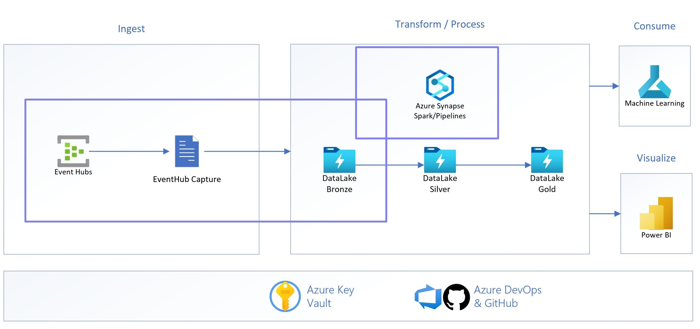

# End to End scenario Streaming-DataLake-Azure Synapse-Machine Learning

This repository will guide you through a complete escenario that ingest information in real-time  storing in Datalake and process it inside Azure Synapse to be able to transform, analize and visualize thta data.

First Part: [Streaming-DataLake-Azure](./wiki/content/readme.md)

Hands-On: [Challenge One](./wiki/content/challenge-1.md)

Transform/Process: [Transform Data](./wiki/content/transforming.md)

Consume: [Machine Learning Integration](./wiki/content/readme.md)

