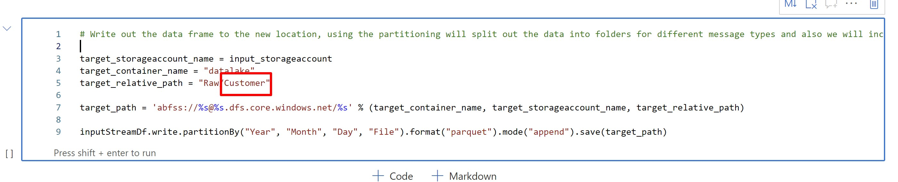
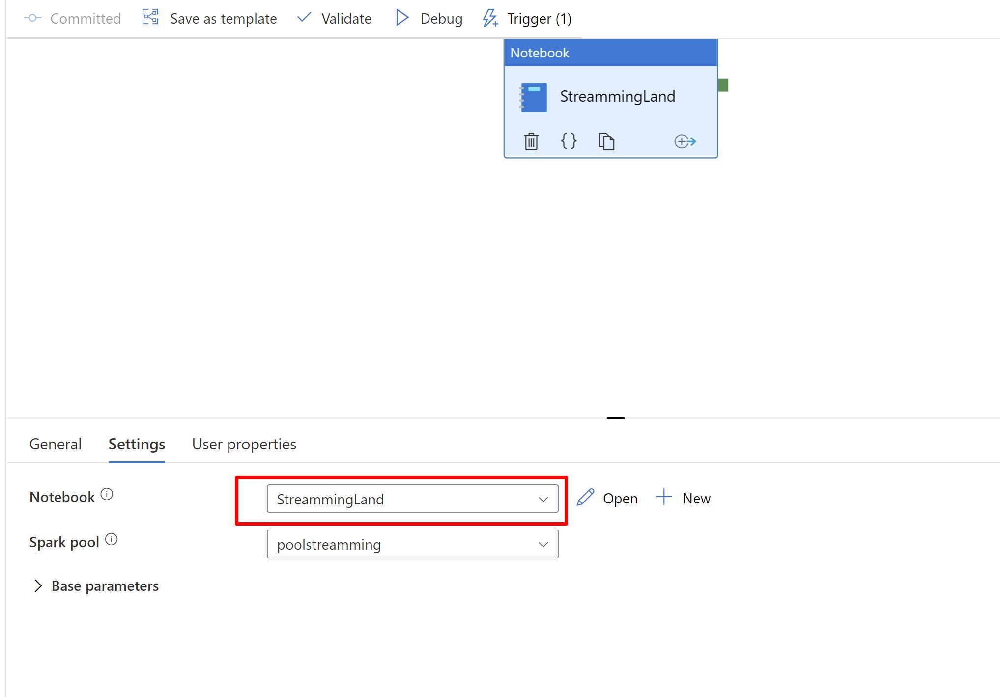
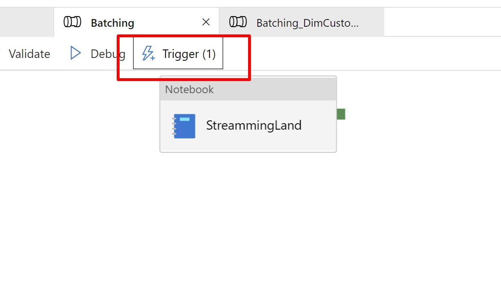
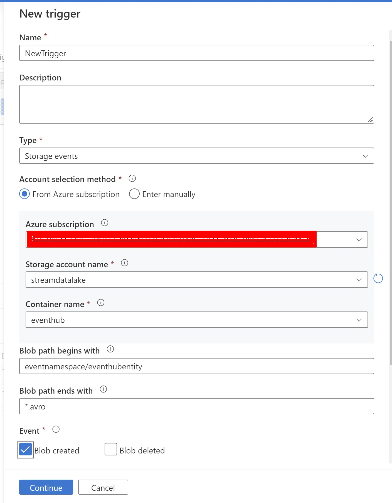
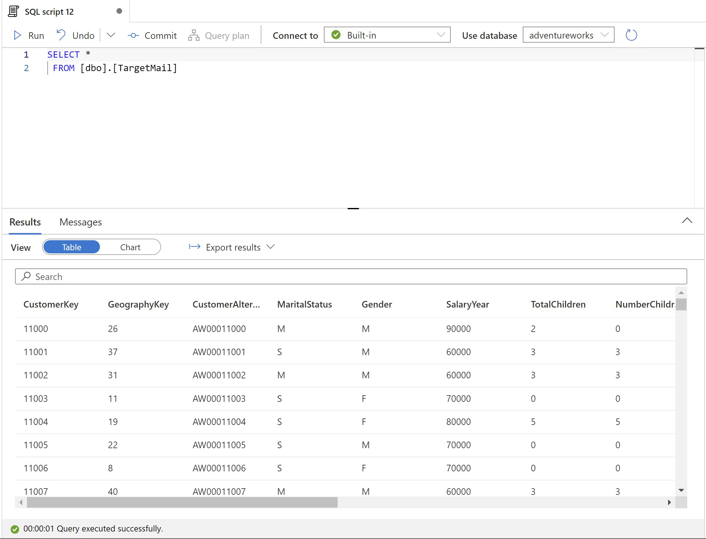

# Challenge One

Now, let's practice, at this point you probably feel more comfortable with all the components involved in this process.

In the data folder, you can find a file named TargetMail.csv, that file contains the information that we will use to create and train our model in Machine Learning.

These are the steps that you have to follow on your own

1. Create an event hub entity 
2. Configure "capture events" for that entity
3. Create a shared access policy for Sending
4. Create a secret in your key vault for the shared access policy generated
5. Clone a Streaming notebook (those in synapse\notebook) and change the name of path destiny

6. Clone a pipeline (whichever is in synapse\pipeline) and change the notebook for the one that you just cloned

7. Create a trigger from the pipeline, click on trigger and select New/Edit, and then fill everything like the image below

8. Publish your changes

9. Send TargetMail.csv info with a python client

10. And Create a View, copy the sample from the synapse\sqlscript

if everything went well, you will see your View like this

Next Step:

Transform/Process: [Transform Data](transforming.md)