# Consume Data -  Machine Learning Integration

Before starting this integration here are some components that you need to create, I don't pretend to add information that is already there, so if you don't know how to do it I'm going to add some links that guide you to the process.

1. Machine Learning Workspace (https://docs.microsoft.com/en-us/azure/machine-learning/quickstart-create-resources)
2. Spark Pool with 2.4 spark (https://docs.microsoft.com/en-us/azure/synapse-analytics/quickstart-create-apache-spark-pool-studio)
3. SQL Dedicated pool (https://docs.microsoft.com/en-us/azure/synapse-analytics/quickstart-create-sql-pool-portal)

Once you have all of this, we'll create a Linked Service for the Machine Learning Workspace, so go to manage tab Manage and select Linked Services

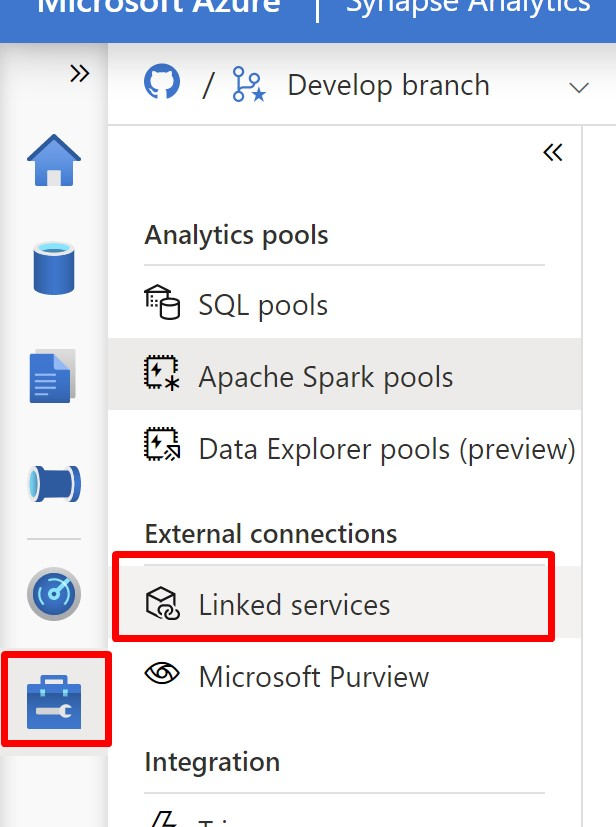

select New and search for Machine Learning

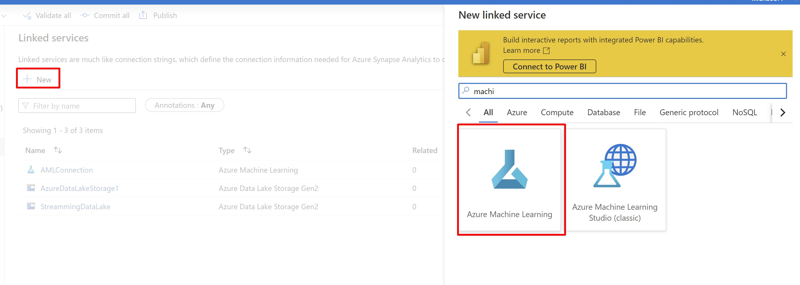

Give a name to the Linked Service, and select the one that you created, test and commit the changes.

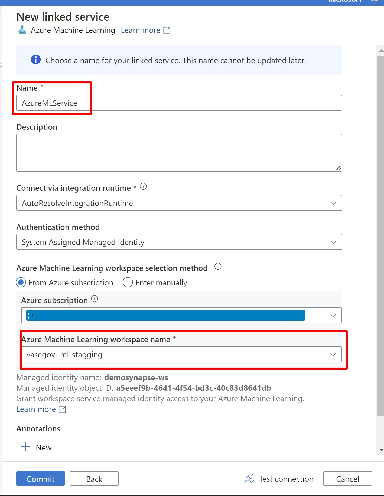

To create the Machine Learning model one method is going to Data tab, click in the (...) button, select Machine Learning option and select "train a new model".

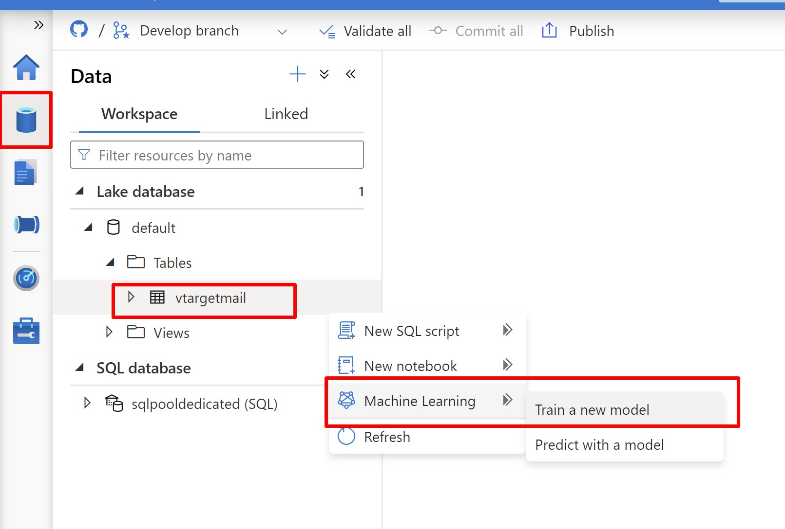

Select classification in the next window and continue

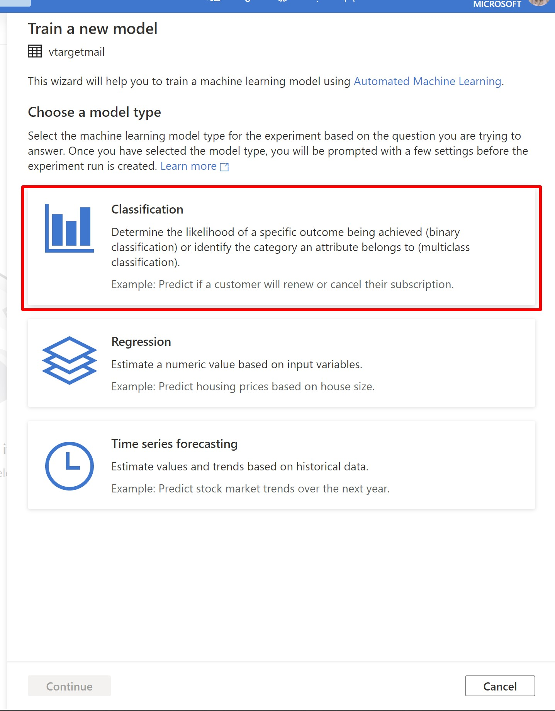

and in this last window you need to add information about the name of you model, experiment, and best model, for TargetColumn select BikeBuyer and for Apache Spark Pool select the one that you created with 2.4 apache spark version and then continue.

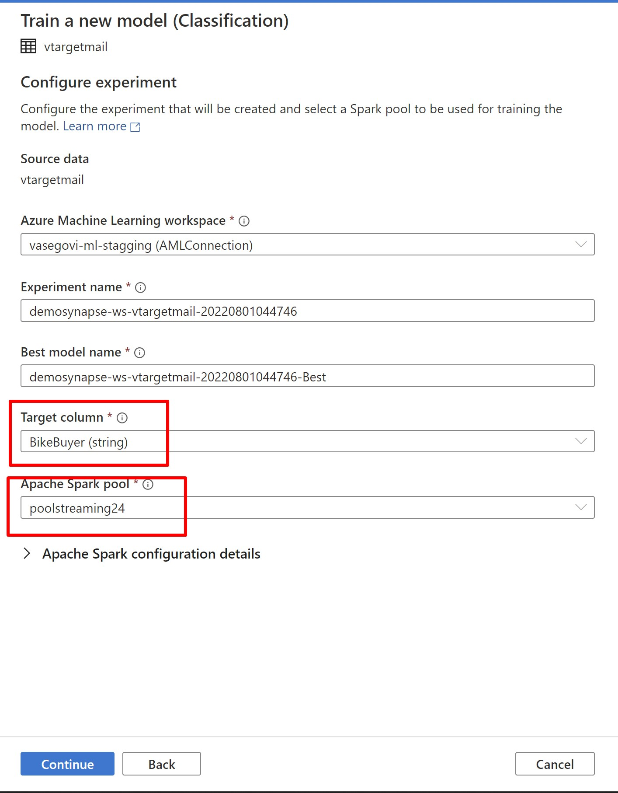

In the next step Enable onnx model y Open in notebook

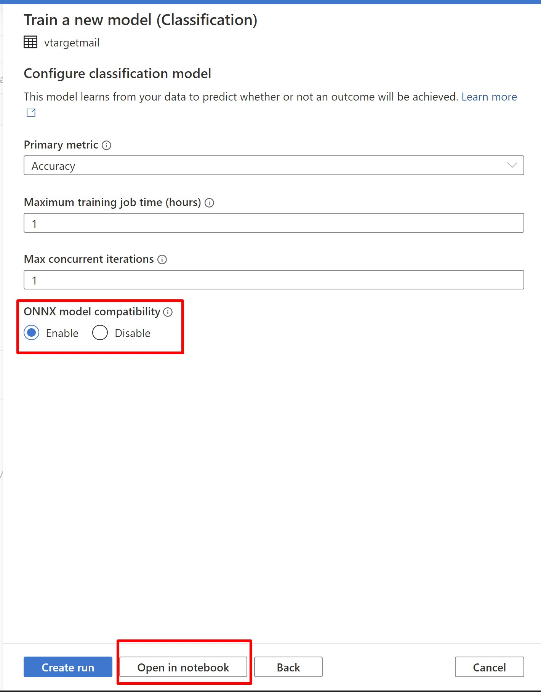

When the Notebook is opened please run all the commands, it will take some time, depending on what you selected but in this case I chose 1hr after that one hour you can go to your Machine Learning Workspace and go to models, you'll see the model that you just created.

## Prediction 

To simulate that we already have information to implement the prediction of our model created, please upload "data\TargetMail.csv" in your datalake and import "machine-learning\MLPredictions.sql" script to create a table un our dedicated pool, you have to change the path where your file is located.

Note: Upload your file in the same datalake that we are using it already.

Run the MLPredictions.sql script and you'll see your records in you sql dedicated pool

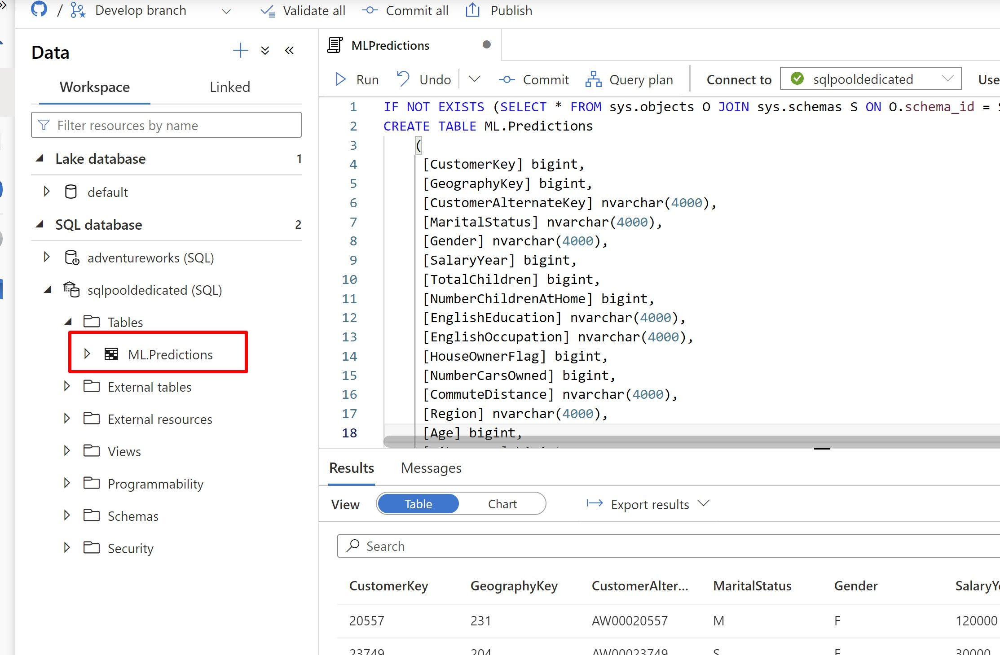

Now that the ML.Predctions table is created select the (...) button and choose Machine Learning and then predict with a model.

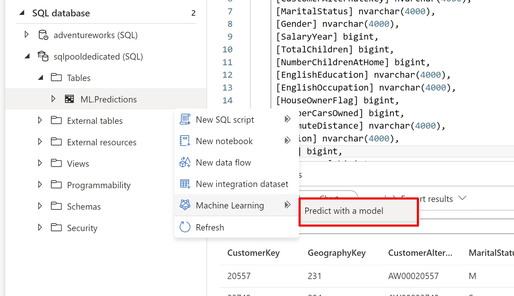

select the model that we created before

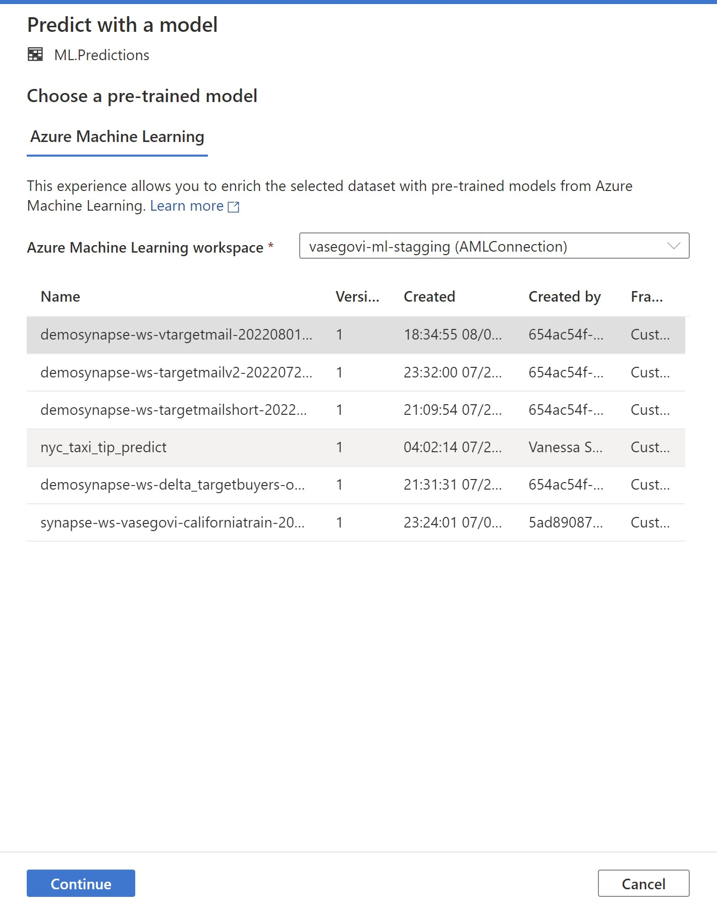

Map the colmuns, usually it select the right source columns with the right target columns automatically.

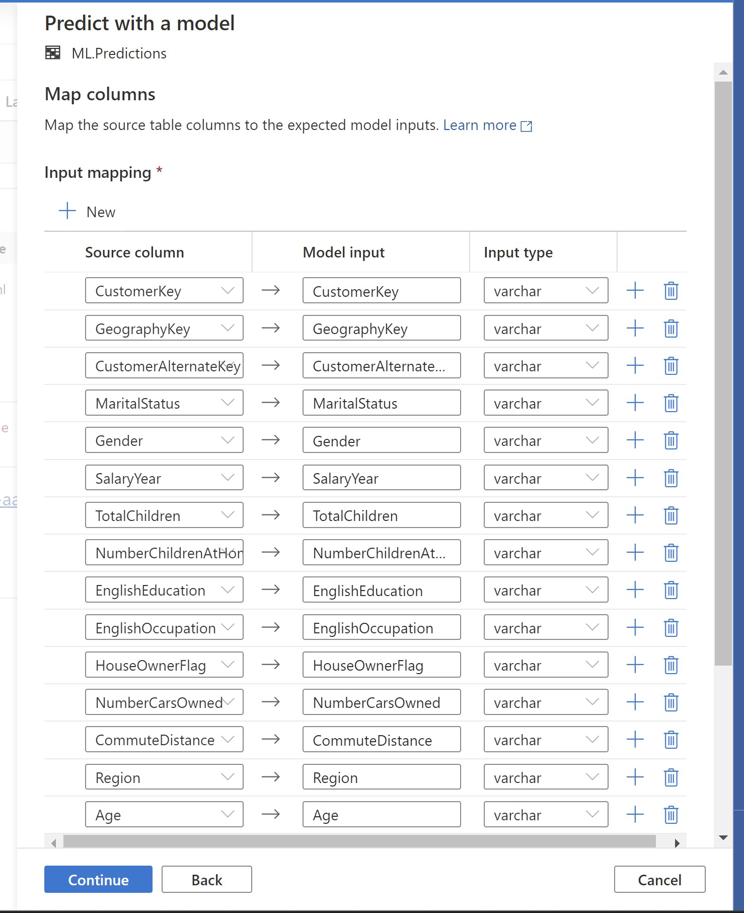

Continue and select a name for the store procedure to create an the table where the metadata of the model will be save.

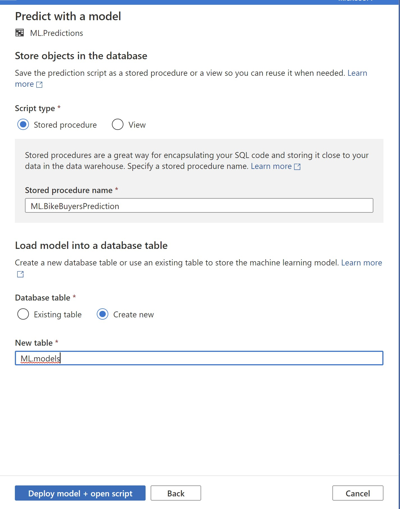

And click on Deploy model + open script

In the script that will show up, find the outputs and delete the second variable

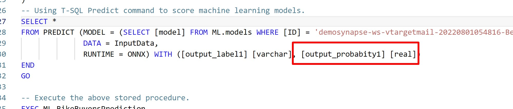

Now you can run the script and it will create a evaluate the information of the table and will predict the value BikeKuyer with the model, with this process now you can create your process to evaluate your information and make a frecuent process to get the info that you need, compare with the info that you already have, etc...

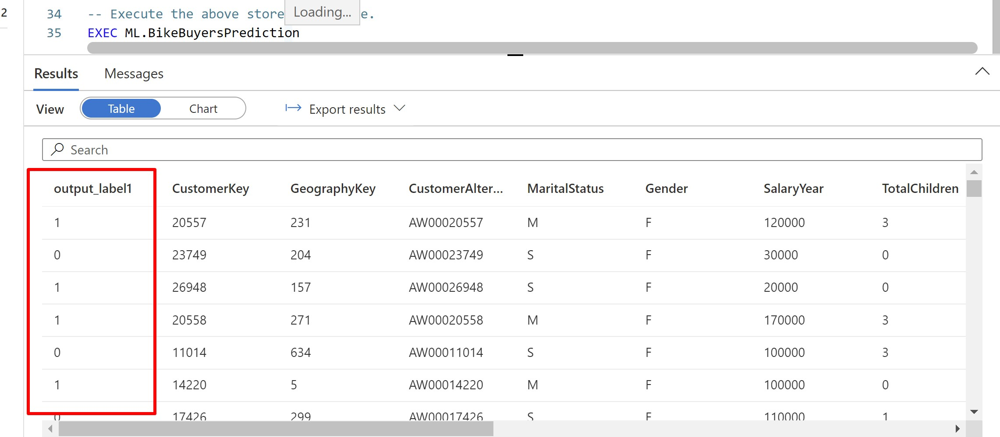