## Components

* Resource Group
* Azure Storage Account with a container named "eventhub" and another named "datalake"
* Event Hub
* Azure Synapse Workspace
* Key Vault
* User Assigned Managed Identity

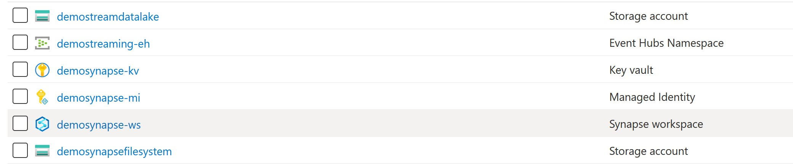

Note: Second Azure Storage Account (demosynapsefilesystem) is created to manage file system for Synapse Workspace.

Once you have all these components created let's start configuring.

## Create an Event Hub Entity

Go to your event hub namespace in the left panel select entity and create event hub.


name it "customer" and create it.

## Enable datalake with Event Hub

To enable storing all data received in streaming in an Event Hub, go to the event hub entity and select Capture.

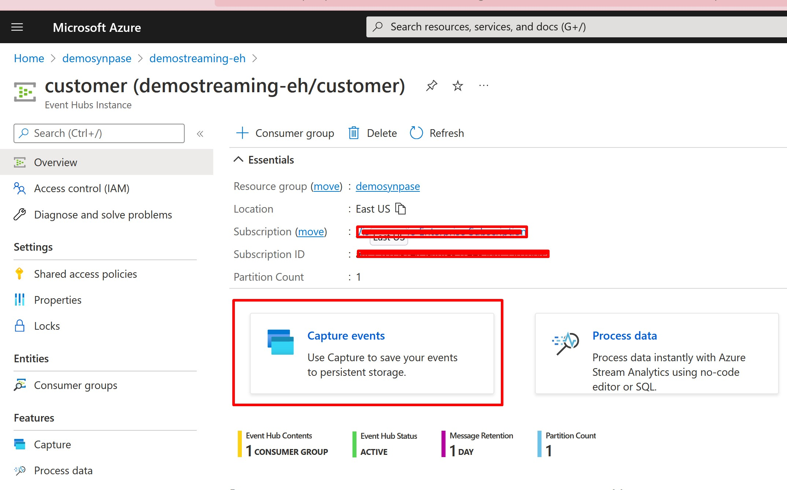

Then set all the information that is needed like this

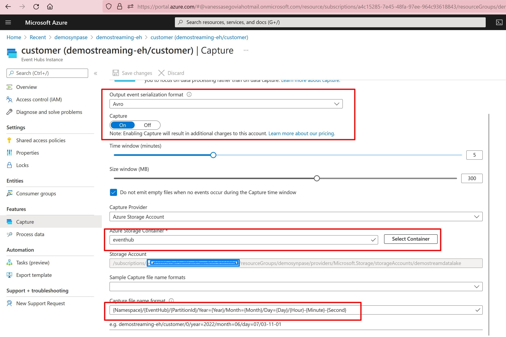

this is the capture file name format that is recommended for this example: {Namespace}/{EventHub}/{PartitionId}/Year={Year}/Month={Month}/Day={Day}/{Hour}-{Minute}-{Second}

Here you go, already have your streaming active and ready to receive information, but now have to be able to read that info from synapse

## Adding blob storage permissions

This step is very tricky because depending on who is running the script, pipeline or trigger is the user that need access to your datalake, so let's add all these in the table above as Contributors and Storage Blob Data Contributor or Storage Blob Data Owner

if your are not familiarized with adding permissions please go to this reference: https://docs.microsoft.com/en-us/azure/role-based-access-control/role-assignments-portal?tabs=current

| role/user | description | purpose |
|---|:---:|:---:|
| your user | this is for the user logged | When you are running scripts manually |
| managed identity | the managed identity we created | Because it will be assigned as administrator |
| wssynapse | the workspace synapse resource | For pipelines |
| ADF | ADF Service Principal | For triggers |

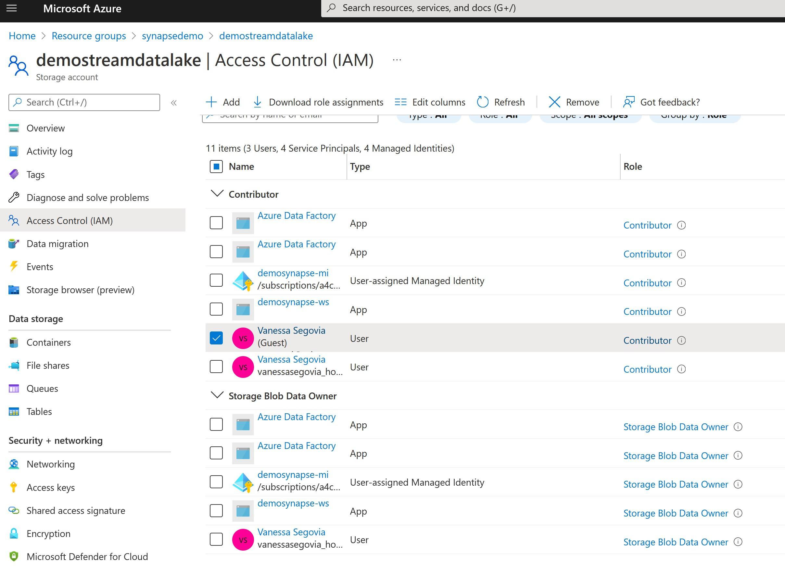

## Assigning  Administrators in Synapse Workspace

Now go to your synapse workspace and add the managed identity in credentials and publish it.

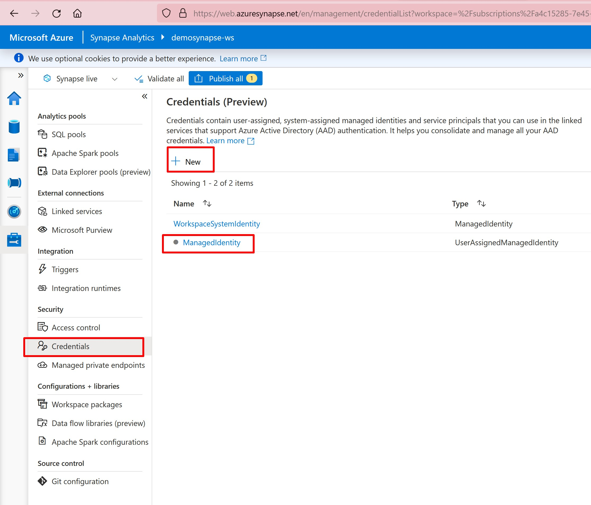

## Creating SAS for EventHub and Key Vaults Secrets

Now let's go to the customer event hub entry and clic to Shared Access policies and create one for sending.

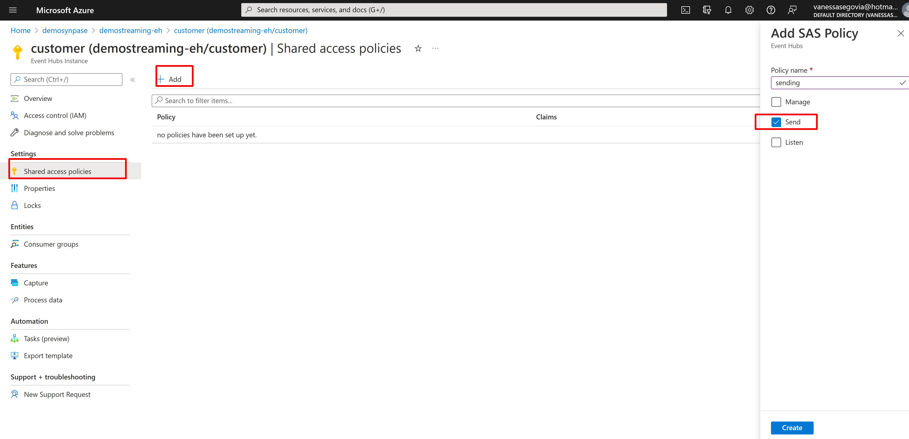

Copy the connection string primary key

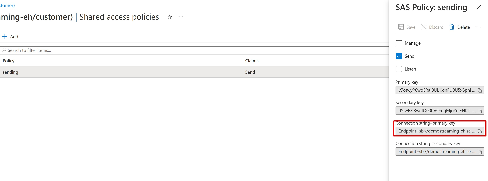

Then navigate to your Key vault and create a new secret

Note: in that connection string eliminate the part from ";" until end, I mean this part ";EntityPath=customer"

Call the secret "customerkv"

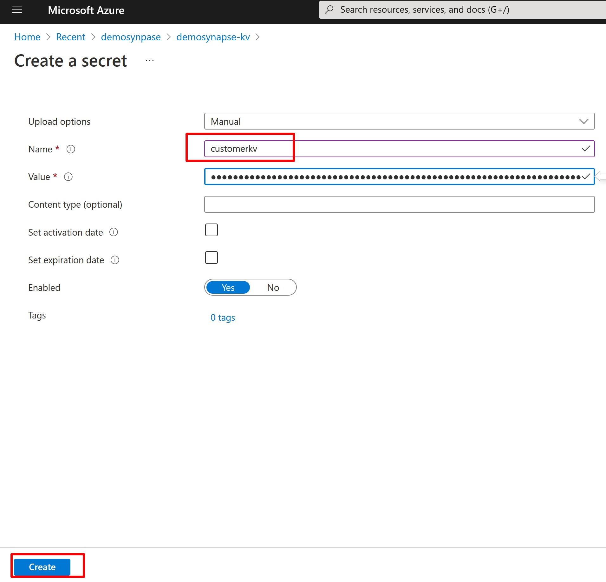

## Importing repository

We need to create notebook, pipeline and a trigger un synapse to process our information stored in the datalake, for this case we already have the code, so you can update and make experiments with this code but first you have to clone it to your own repo, I suggest doing it to Github so you can follow all the steps in this Demo but it also will work in Azure DevOps Repo, so it's up to you.

Clone this repository: https://github.com/vasegovi/synapse-demo

In your synapse workspace go to Manage option and at the end of the menu select "Git Configuration" option.

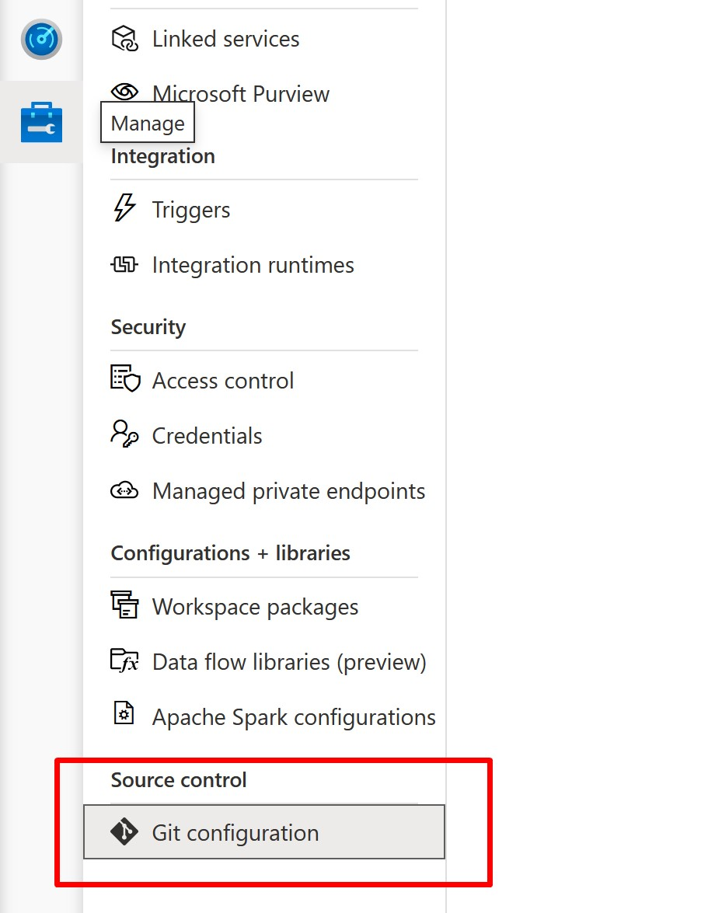

Follow the options required to configure it but there are 2 things that you need to do, select "/synapse" as root folder and check the option for importing existing resources, select the branch where the import will take place and apply. 

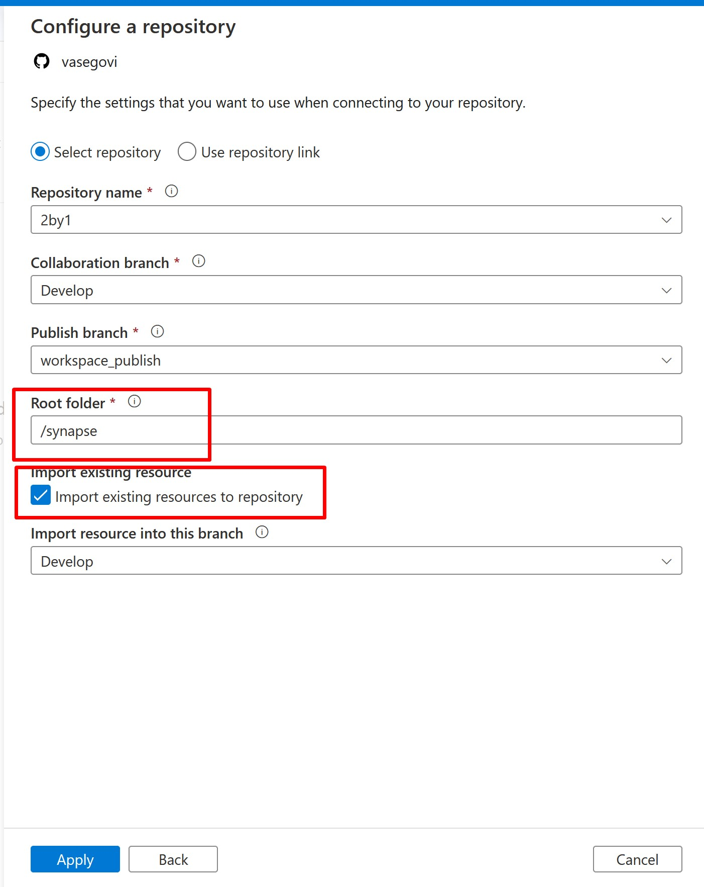

Take a look to Notebooks, Pipelines, and triggers and you'll see that you already have all the needed components to our Demo, but we also need some other features before we can fulfill this.

In a formal environment is highly recommended that you use different branches for collaboration and publishing and isolating main of course, first of all you have to define your branch strategy and implement it, if you want to know more about it, visit: https://buddy.works/blog/5-types-of-git-workflows


## Apache Pool

Select Apache Pool option in the left menu also in Manage option and create a new apache pool with small or medium size we won't need more for Demo purpose.

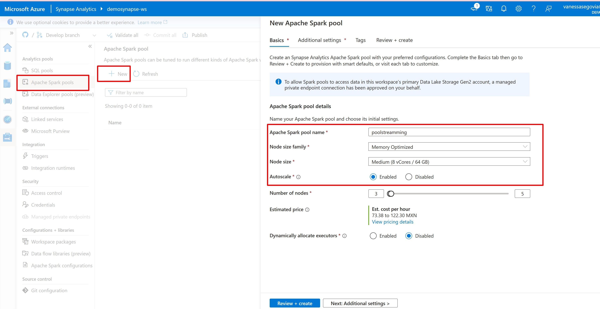

I highly recommend enabling "Automatic pausing" after 15 or 30 minutes because if you are only experimenting with this and forgot to pause the pool you might have trouble with the cost later.

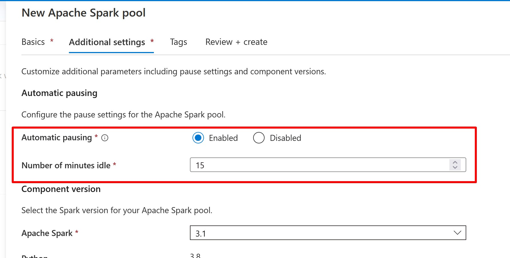

## Database

Create a new Database that we'll use it for creating views of our data.


## Updating information of Managed Identity

## Notebook

Just a few configurations more to finish, go to Develop menu, open StreammingLand notebook and attach it to the pool that you previously created.

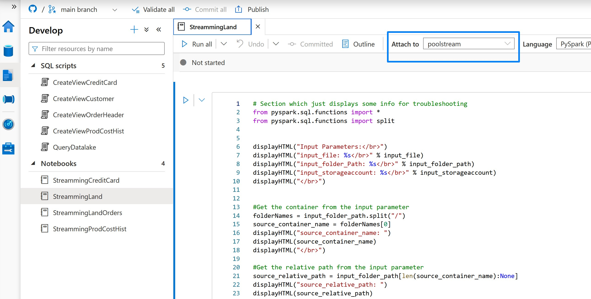


*NOTE:  Do this for all the notebooks

## Pipeline

Click on Integrate option, select the notebook shape in the Batching pipeline and just choose your apache pool in the settings


and add the name of your datalake in input_storageaccount parameter


## Trigger

Last step is configuring Trigger, so go back to Manage and select customer trigger and open it for edit and change this information 

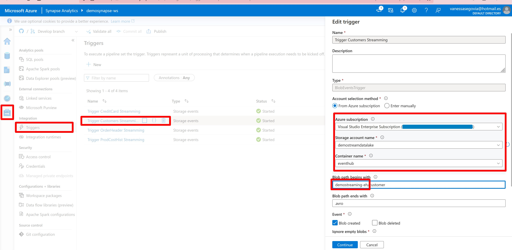

Note: The "Blob path begins with" is the name of your event hub namespace follow by the name of the event hub entry in this case customer

Also configure the subscription information in all triggers, they will be in Stopped status and you’ll configure them in detail later, but if you want this work you have to set all that information.

## Publish

Everything in synapse is already configured so click "Publish" button and accept all the changes.

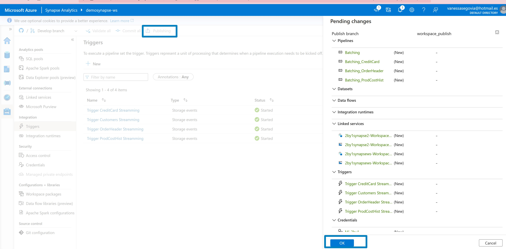

You'll receive a notification that it was published successfully

## Testing with client

You have to clone in you local machine the repo, and in client folder you'll find clients to send information through event hub with a python script.

Open sendcustomer.py in client folder and change the name of the key vault for yours.

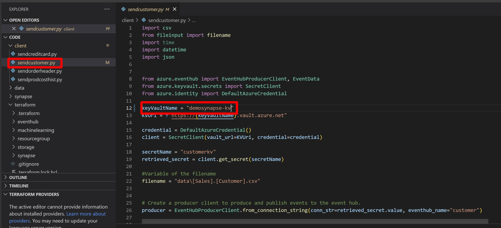

before running, login in your Azure Account

```powershell
az login
```

if you have multiple subscriptions assigned in your account, select the one where you have all the components for this demo.

```powershell
az account set --subscription "My Demos"
```

Then you can run the script and after 5 minutes you'll see in your datalake in eventhub folder the .avro file

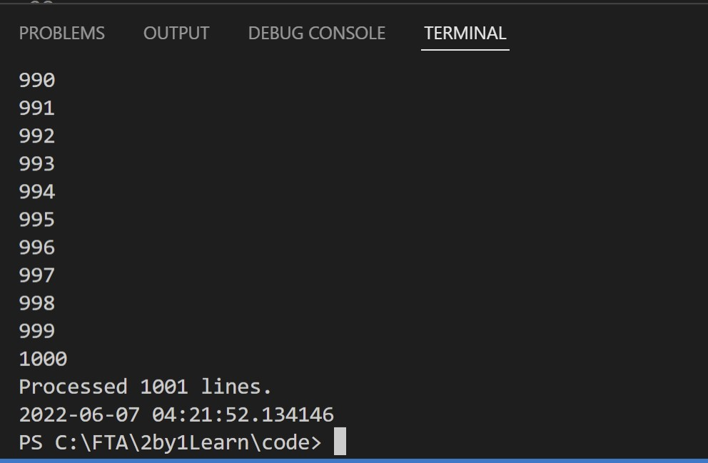

## Monitoring trigger and pipeline

When you send this information to the event hub the Blob event trigger will start procesing the file, when the trigger wakes up you can monitor the activity in Monitor option and then select the trigger and the pipeline that is running.

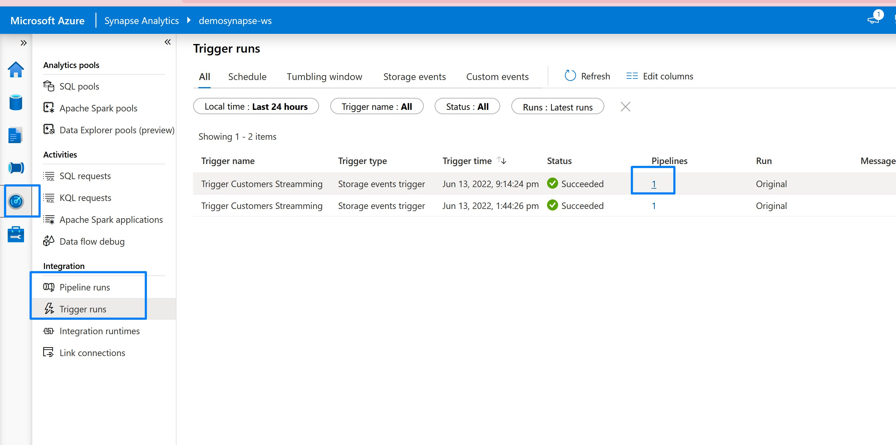

## Create a View

Let's create a view to visualize our information, you can find the script in Develop option and open CreateViewCustomer.sql you only have to change the name of your datalake.

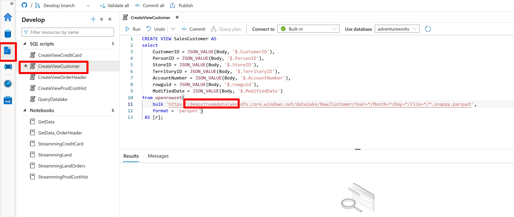

## Configuring the rest

Now your challenge is configuring the rest, you have everything there, notebooks, pipelines, triggers and app clients, now go back and review what configuration is needed to start the rest OrderHeader, CreditCard and ProdCostHist.

Next Step:

Hands-On: [Challenge One](challenge-1.md)