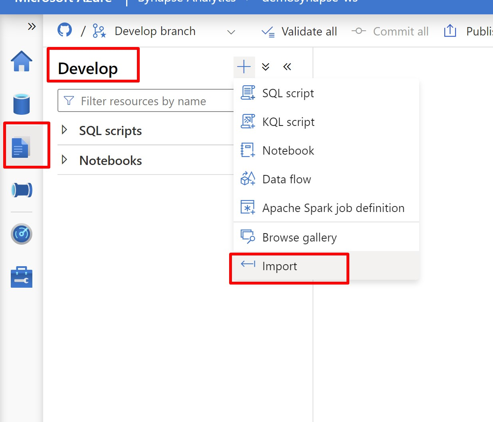
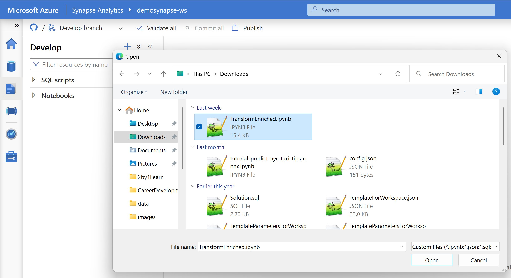
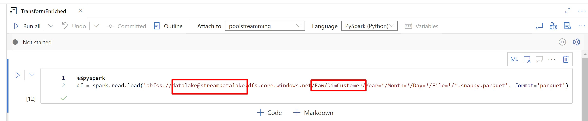
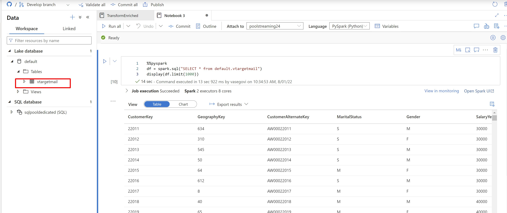

# Transforming Data

In the folder named "Transform" you will find a notebook named "TransformEnriched.ipynb" dowloading it and import it in your workspace.

To import it go the Develop Section inside the synapse workspace and click in import

select the notebook "TransformEnriched.ipynb" and will be in your workspace

Open the notebook and you only need to change for the name or your datalake and the name of the folder where the parquet is stored.

Attach a spark pool in the notebook and run all the commands, once everything finished in you Linked tab and you can query that table to check that all the info is ok.

You can continue with the next part Consume: [Machine Learning Integration](consume.md)